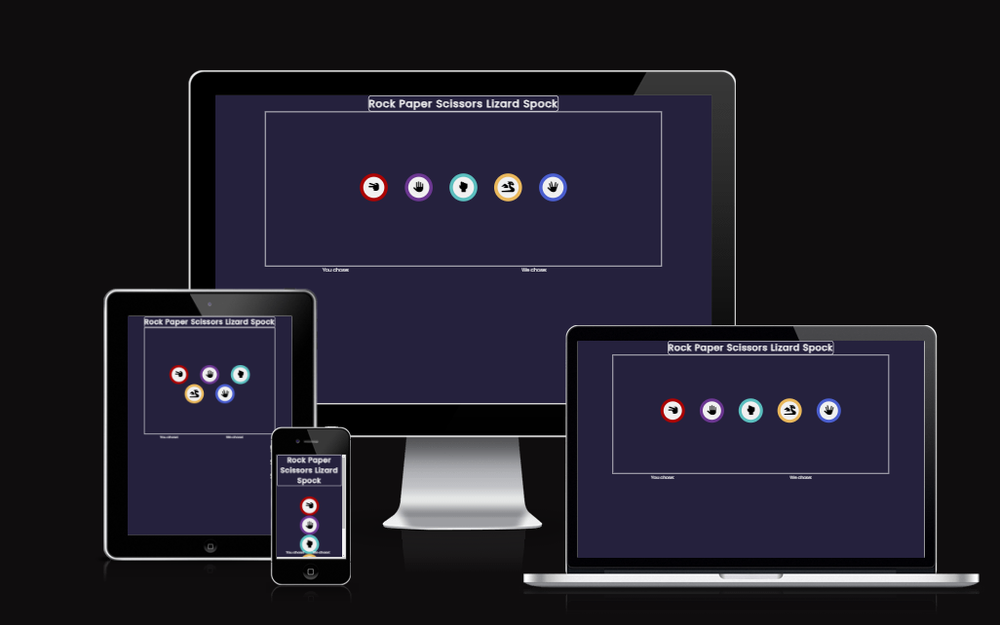
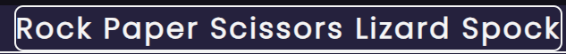
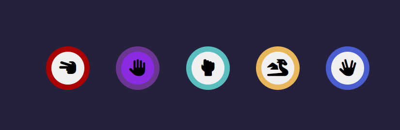
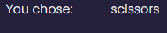
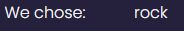
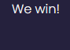

# Rock Paper Scissors Lizard Spock

Rock Paper Scissors Lizard Spock is a site which looks to demonstrate the workings of JavaScript in the contaxt of a real world example.  The sight is aimed at those who are looking for an example of how to implement JavaScript ideas into a fun site, but also those looking for an exiting spin on the traditional game, those looking to honourably settle a dispute among friends, or those who want to kill some time playing a fun game. Rock Paper Scissors Lizard Spock is a fully responsive game allowing users to play the game popularised by 'The Big Bang Theory'.

## Features

**- Heading**

- The heading, featured at the top of the page, clearly and prominently displays the in a manner that is easy for the user to see. This also allows the user to locate the name of the game as soon as they view the page.

**- Game Area**

- This section allows the user to play the game.
- The icons allow the user to start the game, simply by clicking on them. Th icons are clear, and react when hovered over.

**- The choices area**

- this area shows the user what choice they and the computer have selected.
 

**- The Results area**

- This area shows the user the results of the match.

### Features left to implement

- We will look to implement a score board in future, allowing the user to keep track of their record.

## Testing

- I tested that this page works in OperaGX, Chrome and Firefox.
- I have verified that the project is responsive, functional and looks good on all the standard screen sizes by using the devtools device toolbar.
- I confirmed that all text in each section is easy to read and understand.
- I tested the results are all correct and shopwing as they should be.

